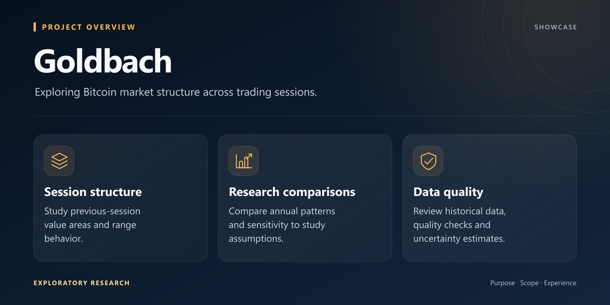
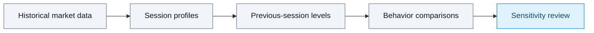

*Concept illustration created for this showcase.*

<h1>Goldbach</h1>

<strong>Exploring Bitcoin market structure, one session at a time.</strong>

  
  
  

## Purpose

Goldbach is an exploratory research project studying how Bitcoin behaves around the previous session's value area. It uses historical BTC/USDT spot data to examine direction, time spent within a range and reversals through a reproducible analytical workflow.

The project focuses on clearly defined observations, comparisons and uncertainty.

## Research focus

- Previous-session value-area analysis.
- Session-level range behavior and reversal observations.
- Annual comparisons and sensitivity analysis.
- Documented data-quality checks and uncertainty estimates.

## Visual overview

## High-level workflow

Annual comparisons and sensitivity analysis help examine how the study's assumptions affect the observations.

## Stack

Python, NumPy and pandas support data preparation and analysis.

## Research status

Exploratory research using volume profiles approximated from one-minute candles. The analysis examines how session definitions and profile assumptions affect the observed patterns.

## About this repository

This repository is a public showcase. Only presentation material is published; source code and private data remain private.

**Last showcase review:** 2026-09-12 (Europe/Paris).
