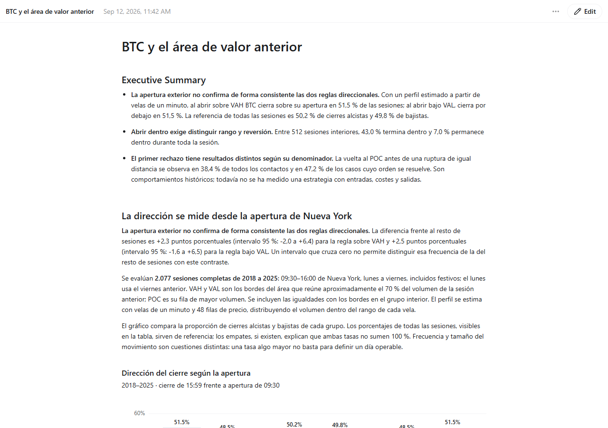
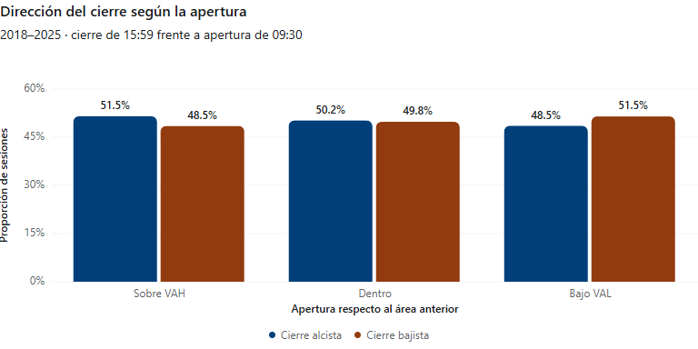
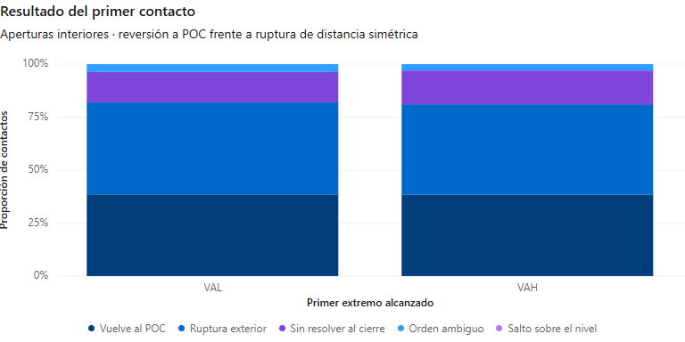
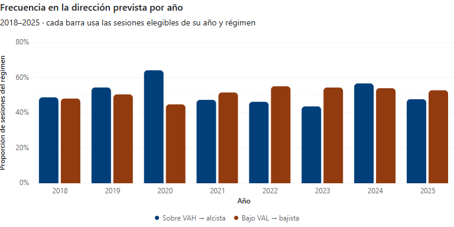
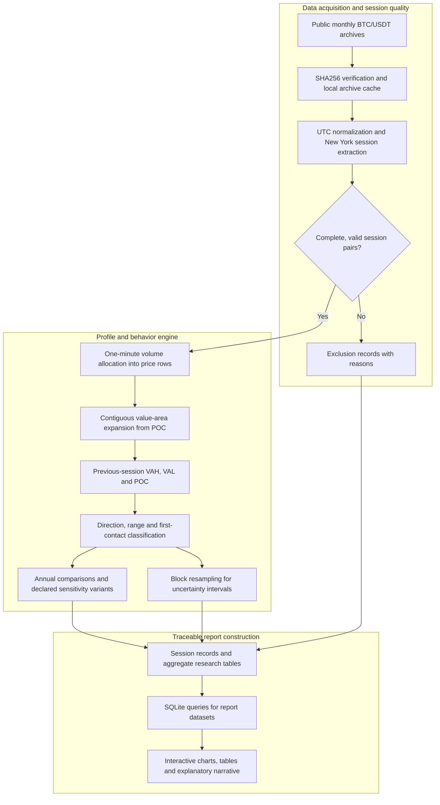

# Goldbach

### What does Bitcoin's previous value area actually tell us?

A reproducible research pipeline that examines **BTC/USDT spot market behavior** around the
previous session's value area. It turns public one-minute market data into session profiles,
direction and range studies, first-contact analysis, and an interactive report with traceable evidence.

*Actual report capture from September 12, 2026. The original report interface is in Spanish; the screenshot is unedited.*

## What the project studies

Goldbach asks three concrete questions about the previous session's **value area high (VAH)**,
**value area low (VAL)** and **point of control (POC)**:

- **Direction:** does opening above VAH or below VAL distinguish the direction of the subsequent session?
- **Range:** when the session opens inside the previous value area, does it close inside, stay inside throughout, or reach both boundaries?
- **First contact:** after the first touch of a boundary, does price reach the POC before an equally distant external boundary?

The project separates these questions. A session that closes inside the value area may still
have traded outside it, and a frequency of upward closes does not describe a trading strategy's return.

## The current study

| Component | Definition |
|---|---|
| Market | BTC/USDT spot, using Binance's public historical archives |
| Study period | Eight complete years, 2018–2025 |
| Session | Weekdays, 09:30–16:00 in New York, with daylight-saving time handled explicitly |
| Required observations | Complete pairs of previous and current sessions, each containing 390 one-minute candles |
| Main volume profile | 48 equal-width price rows; a 70% value-area target |
| Volume allocation | Each candle's volume is distributed across its low-to-high range |
| Valid study pairs | 2,077 included; 11 excluded, as recorded in the project's validation report |
| Uncertainty | Exploratory 95% intervals using 2,000 resamples of 20-session blocks within each year |

The previous session's levels are fixed before the current session is classified. Monday uses
Friday's profile in this calendar. Missing or irregular sessions are recorded as exclusions;
the pipeline does not fill gaps to manufacture complete observations.

## Opening position and session direction

The report compares openings **above VAH**, **inside the value area**, and **below VAL**, showing
both upward and downward closes. It also calculates mean and median open-to-close returns,
sample sizes, and comparisons against the other sessions.

In the current report, the two outside-opening directional frequencies are both approximately
51.5%. The report does not treat that alone as an established edge: it evaluates uncertainty,
comparison groups and year-by-year stability.

## Range behavior and the first boundary touch

For sessions that open inside the previous area, Goldbach measures closing inside, remaining
inside for the entire session, the share of one-minute closes inside, and whether both boundaries
are reached. These are different measurements, not mutually exclusive outcomes.

First-contact analysis follows one initial boundary event per session. It distinguishes a return
to the POC, an external breakout, an unresolved outcome, a gap over the boundary, and an ambiguous
order of events within a one-minute candle. Unresolved and ambiguous cases remain visible in the report.

## Stability and sensitivity

The study breaks results out by year and compares the earlier and later periods. Its declared
variants change the profile resolution, value-area percentage, volume-allocation method and
expansion convention. A same-width band centered on the previous range provides another
descriptive comparison.

All declared variants are retained. The research workflow does not select the configuration
that happens to give the most favorable result.

## How the research pipeline is built

Python performs the original profile, event and uncertainty calculations. SQLite then queries
the resulting research tables to construct the report's views. Each report dataset retains its
source and metric definitions, and the builder checks dataset and artifact-size limits.

## Engineering details

| Area | Implementation |
|---|---|
| Data acquisition | Python downloader with checksum verification, reusable verified archives and timestamp validation |
| Session analysis | pandas for time handling and session organization; NumPy for profiles, event analysis and resampling |
| Value-area calculation | A separate Decimal-based component with explicit expansion and tie-breaking rules |
| Report assembly | Python and SQLite, with source-backed datasets, chart definitions and tables |
| Verification | Unit tests covering volume conservation, profile boundaries, event ambiguity, session timing and incomplete-data exclusion |

The project's recorded September 12 review reports 34 passing tests and an independent
reconstruction of selected profiles from the original public archives. These are the recorded
project checks, not a new test run performed for this showcase update.

## Scope of the results

This is an exploratory study of historical session behavior. The volume profile is approximated
from one-minute candles rather than individual trades. The project does not execute orders,
simulate a portfolio or calculate strategy profit and loss.

## About this repository

This repository is the project's public showcase. It contains English documentation and selected,
unaltered screenshots of the actual report. Source code, raw datasets, notebooks and the original
research output files remain private.

**Last showcase review:** 2026-09-20 (Europe/Paris).
